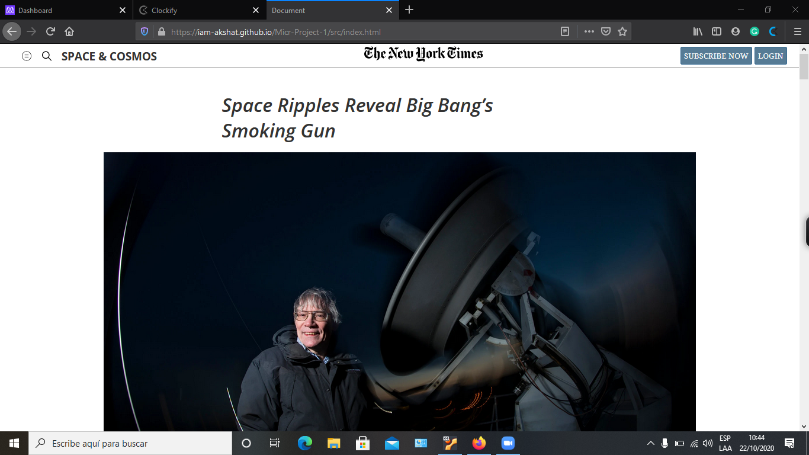

# Project 1: Positioning and Floating Elements

> This assignment consists of making a clone of a New York Times article page.

- Embedding images
- Floats and positioning
- The box model
- flex box
- grid

link to the original page: (https://www.nytimes.com/2014/03/18/science/space/detection-of-waves-in-space-buttresses-landmark-theory-of-big-bang.html?_r=0)

## Built With

- HTML
- CSS

## Live Demo

[Live Demo Link](https://iam-akshat.github.io/Micr-Project-1/src/index.html
)

## Authors

👤 **Helman**

- GitHub: [@helman101](https://github.com/helman101)
- LinkedIn: [Linkedin](https://www.linkedin.com/in/helman-andres-5187271b1/)

👤 **Akshat**

- GitHub: [@iam-Akshat](https://github.com/iam-Akshat)
- Twitter: [@akshatsethi](https://twitter.com/akshatsethi)
- LinkedIn: [LinkedIn](https://www.linkedin.com/in/akshat-sethi-786737ba/)

## Show your support

Give a ⭐️ if you like this project!

## 📝 License

This project is [MIT](lic.url) licensed.